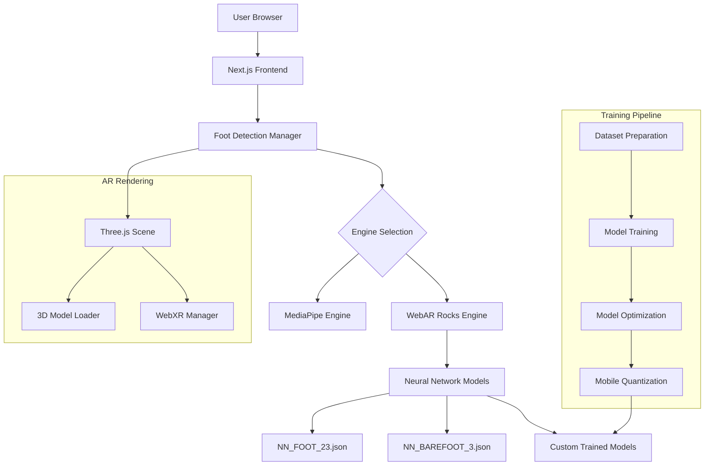
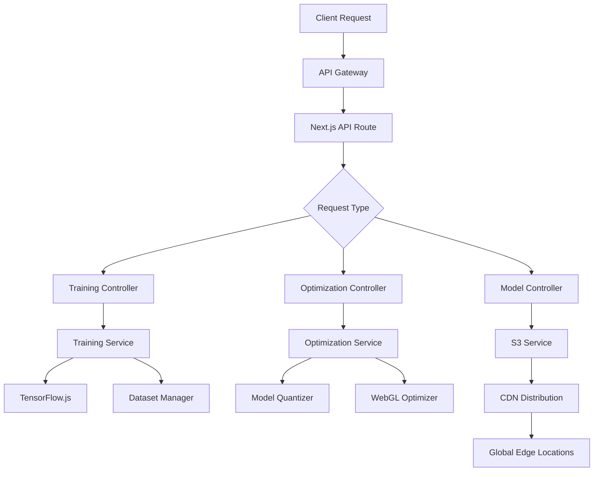
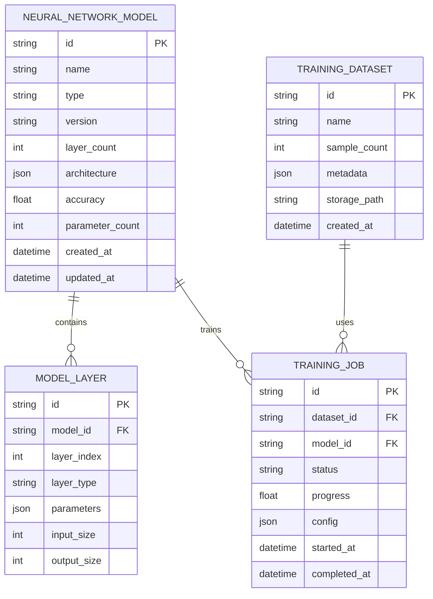

# Technical Architecture: Neural Network Integration for AR Foot Detection

## 1. Architecture Design



## 2. Technology Stack

### Frontend
- **Framework**: Next.js 14 with React 18
- **3D Rendering**: Three.js with @react-three/fiber
- **AR Framework**: WebXR API with hit-testing
- **State Management**: React Context + Custom Hooks

### Machine Learning
- **Inference**: TensorFlow.js for WebGL acceleration
- **Training**: TensorFlow.js Node backend
- **Model Format**: WebAR Rocks JSON format
- **Optimization**: 16-bit quantization, WebGL shader optimization

### Backend Services
- **Model Storage**: AWS S3 / Backblaze B2
- **CDN**: CloudFront for global model distribution
- **API**: Next.js API routes for model management

## 3. Route Definitions

| Route | Purpose |
|-------|---------|
| `/ar` | Main AR experience with foot detection |
| `/ar-foot-detection` | Dedicated foot detection testing |
| `/api/models` | Model management API |
| `/api/models/train` | Custom training endpoint |
| `/api/models/optimize` | Model optimization endpoint |
| `/training` | Training pipeline dashboard |

## 4. API Definitions

### 4.1 Model Management API

```typescript
// GET /api/models
interface ModelListResponse {
  models: ModelInfo[];
}

interface ModelInfo {
  id: string;
  name: string;
  type: 'foot' | 'barefoot' | 'custom';
  version: string;
  size: number;
  accuracy: number;
  url: string;
  optimized: boolean;
}

// POST /api/models/train
interface TrainModelRequest {
  datasetId: string;
  modelType: 'foot' | 'barefoot';
  config: TrainingConfig;
}

interface TrainModelResponse {
  jobId: string;
  status: 'queued' | 'training' | 'completed' | 'failed';
  progress: number;
}

// POST /api/models/optimize
interface OptimizeModelRequest {
  modelId: string;
  optimization: 'quantization' | 'pruning' | 'mobile';
}

interface OptimizeModelResponse {
  optimizedModelId: string;
  originalSize: number;
  optimizedSize: number;
  compressionRatio: number;
}
```

### 4.2 Detection API

```typescript
// WebSocket /api/detection/stream
interface DetectionFrame {
  frameId: string;
  timestamp: number;
  keypoints: Keypoint[];
  confidence: number;
  engine: 'mediapipe' | 'webarrocks';
  modelVersion: string;
}

interface Keypoint {
  name: string;
  x: number;
  y: number;
  score: number;
}
```

## 5. Server Architecture



## 6. Data Models

### 6.1 Neural Network Models



### 6.2 Database Schema

```sql
-- Neural Network Models Table
CREATE TABLE neural_network_models (
    id UUID PRIMARY KEY DEFAULT gen_random_uuid(),
    name VARCHAR(255) NOT NULL,
    type VARCHAR(50) NOT NULL CHECK (type IN ('foot', 'barefoot', 'custom')),
    version VARCHAR(50) NOT NULL,
    layer_count INTEGER NOT NULL,
    architecture JSONB NOT NULL,
    accuracy FLOAT,
    parameter_count INTEGER,
    created_at TIMESTAMP WITH TIME ZONE DEFAULT NOW(),
    updated_at TIMESTAMP WITH TIME ZONE DEFAULT NOW(),
    UNIQUE(name, version)
);

-- Model Performance Metrics
CREATE TABLE model_metrics (
    id UUID PRIMARY KEY DEFAULT gen_random_uuid(),
    model_id UUID REFERENCES neural_network_models(id),
    metric_type VARCHAR(50) NOT NULL,
    metric_value FLOAT NOT NULL,
    device_type VARCHAR(50),
    timestamp TIMESTAMP WITH TIME ZONE DEFAULT NOW()
);

-- Training Sessions
CREATE TABLE training_sessions (
    id UUID PRIMARY KEY DEFAULT gen_random_uuid(),
    model_id UUID REFERENCES neural_network_models(id),
    dataset_id UUID,
    config JSONB NOT NULL,
    status VARCHAR(50) NOT NULL,
    progress FLOAT DEFAULT 0,
    started_at TIMESTAMP WITH TIME ZONE DEFAULT NOW(),
    completed_at TIMESTAMP WITH TIME ZONE,
    error_message TEXT
);

-- Create indexes for performance
CREATE INDEX idx_models_type ON neural_network_models(type);
CREATE INDEX idx_models_accuracy ON neural_network_models(accuracy DESC);
CREATE INDEX idx_metrics_model_id ON model_metrics(model_id);
CREATE INDEX idx_metrics_timestamp ON model_metrics(timestamp DESC);
CREATE INDEX idx_training_sessions_status ON training_sessions(status);
```

## 7. Component Architecture

### 7.1 Detection Engine Components

```typescript
// Core detection engine interface
interface FootDetectorEngine {
  name: string;
  type: 'mediapipe' | 'webarrocks';
  initialize(): Promise<void>;
  estimate(video: HTMLVideoElement, options?: EstimateOptions): Promise<PoseResult>;
  dispose(): void;
}

// Enhanced WebAR Rocks engine with neural networks
class WebARRocksFootEngine implements FootDetectorEngine {
  private neuralNetworks: NeuralNetwork[];
  private currentModel: string;
  
  constructor(config: WebARRocksConfig) {
    this.neuralNetworks = this.loadNeuralNetworks(config.models);
    this.currentModel = config.defaultModel;
  }
  
  async estimate(video: HTMLVideoElement, options: EstimateOptions): Promise<PoseResult> {
    const model = this.getCurrentModel();
    const processedFrame = await this.preprocessFrame(video);
    
    // Run inference with selected neural network
    const predictions = await this.runInference(processedFrame, model);
    
    return this.postProcessPredictions(predictions);
  }
}
```

### 7.2 Training Pipeline Components

```typescript
// Training pipeline orchestrator
class TrainingPipeline {
  private datasetManager: DatasetManager;
  private modelTrainer: ModelTrainer;
  private modelOptimizer: ModelOptimizer;
  
  async trainNewModel(config: TrainingConfig): Promise<TrainingResult> {
    // 1. Prepare dataset
    const dataset = await this.datasetManager.load(config.datasetId);
    const preparedData = await this.datasetManager.prepare(dataset);
    
    // 2. Create and train model
    const model = await this.modelTrainer.createModel(config.architecture);
    const trainingResult = await this.modelTrainer.train(model, preparedData);
    
    // 3. Optimize for deployment
    const optimizedModel = await this.modelOptimizer.optimize(
      trainingResult.model,
      config.optimization
    );
    
    // 4. Export in WebAR Rocks format
    const exportedModel = await this.exportModel(optimizedModel);
    
    return {
      modelId: exportedModel.id,
      accuracy: trainingResult.accuracy,
      modelSize: exportedModel.size,
      trainingTime: trainingResult.duration
    };
  }
}
```

## 8. Performance Optimization

### 8.1 Model Optimization Pipeline

```typescript
// Multi-stage optimization pipeline
class ModelOptimizationPipeline {
  async optimize(model: tf.LayersModel, target: 'mobile' | 'desktop'): Promise<tf.LayersModel> {
    let optimized = model;
    
    // Stage 1: Quantization
    optimized = await this.quantizer.quantize(optimized, {
      bits: target === 'mobile' ? 8 : 16,
      signed: true
    });
    
    // Stage 2: Pruning
    optimized = await this.pruner.prune(optimized, {
      targetSparsity: target === 'mobile' ? 0.5 : 0.3
    });
    
    // Stage 3: Knowledge distillation
    if (target === 'mobile') {
      optimized = await this.distiller.distill(optimized, {
        teacherModel: model,
        temperature: 4.0
      });
    }
    
    return optimized;
  }
}
```

### 8.2 Runtime Performance Targets

| Metric | Mobile | Desktop |
|--------|--------|---------|
| Inference Time | < 50ms | < 30ms |
| Frame Rate | 30 FPS | 60 FPS |
| Memory Usage | < 200MB | < 500MB |
| Model Size | < 10MB | < 50MB |
| Accuracy | > 90% | > 95% |

## 9. Security Considerations

### 9.1 Model Protection
- Encrypt models at rest in S3
- Use signed URLs for model downloads
- Implement rate limiting for API endpoints
- Add watermarking to trained models

### 9.2 Privacy Protection
- Process video frames locally in browser
- Anonymize training data
- Implement data retention policies
- Use differential privacy for training

## 10. Monitoring and Analytics

### 10.1 Performance Monitoring
```typescript
interface PerformanceMetrics {
  inferenceTime: number;
  frameRate: number;
  memoryUsage: number;
  modelAccuracy: number;
  detectionConfidence: number;
  engineType: string;
  modelVersion: string;
}

class PerformanceMonitor {
  trackMetrics(metrics: PerformanceMetrics): void {
    // Send to analytics service
    this.analytics.track('detection_performance', metrics);
    
    // Check for performance issues
    if (metrics.frameRate < 15) {
      this.alertLowPerformance(metrics);
    }
  }
}
```

### 10.2 Error Tracking
- Model loading failures
- Inference errors
- Performance degradation
- User experience issues

This architecture provides a robust, scalable foundation for integrating advanced neural network models into your AR foot detection system while maintaining high performance across mobile and desktop platforms.